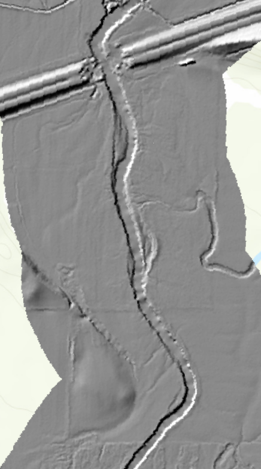

```{r setup, include=FALSE}
knitr::opts_chunk$set(echo = TRUE)
```

```{r}
library("tidyverse")
library("raster")
library("tmap")
library("sf")
```

State data frame:
```{r}
ne_co <- sf::read_sf("../data/County_Boundaries-_Census.shp") %>% sf::st_make_valid()
ne_col_pop_pc <- ne_co %>% mutate(col_age = ((M18and19Y + M20Y + M21Y + M22to24Y + F18and19Y +F20Y + F21Y + F22to24Y)/Total)*100)
map1 <- tm_shape(ne_col_pop_pc) +
  tm_fill(col = "col_age", title = "Percent of College Student
          (Age 18 ~ 24)", palette = "YlGnBu") +
  tm_borders(col = "white", lwd = 0.5, lty = "dotted") +
  tm_scale_bar(breaks = c(0,50,100), position=c("right", "top")) 
map1
```

County data frame:
```{r}
tmap_mode("plot")
lan_co <- sf::read_sf("../data/lancaster_county.shp") %>% sf::st_make_valid()
mu_bo <- sf::read_sf("../data/Municipal_Boundaries.shp") %>% sf::st_make_valid()
st_pk <- sf::read_sf("../data/State_Park_Locations.shp") %>% sf::st_make_valid()
streams <- sf::read_sf("../data/Streams_303_d_.shp") %>% sf::st_make_valid()
mu_bo <- st_intersection(mu_bo, lan_co) %>% sf::st_make_valid()
st_pk <- st_intersection(st_pk, lan_co) %>% sf::st_make_valid()
streams <- st_intersection(streams, lan_co) %>% sf::st_make_valid()
dem <- raster::raster("../data/lancaster_dem/lc_dem.tif")
map2_1 <- tm_shape(st_pk) + tm_dots(size = 0.5, col = "darkgreen", shape = 24, border.col = "#F1C40F", border.lwd = 1)
map2_2 <- tm_shape(mu_bo) +
  tm_fill(col = NA, alpha = 0.65) +
  tm_borders(col = "gray", lwd = 0.5, lty = "solid") +
  tm_text("NAME", size = 0.65)
map2_3 <- tm_shape(streams) + tm_lines(col = "Impairment", palette = "BrBG", alpha = .7) +tm_layout(legend.text.size = 0.65, legend.outside = T)
map2_4 <- tm_shape(dem) + tm_raster(palette = "YlOrBr", alpha = .65) + tm_layout(legend.outside = T)
```

Putting it together
```{r}
elements <- tm_compass(type = "radar", size = 3, show.labels = 1.25, position = c("right", "top")) + tm_scale_bar(breaks = c(0, 5, 10), text.size = .75) + tm_layout(title= "Lancaster County Map", title.size = 5, outer.bg.color = "#E4E2DA")
library(grid)
map1 <- map1 +
  tm_shape(lan_co) + tm_borders(lwd = 3, col = "red") 
map2_4 + map2_3 + map2_2 + map2_1 + elements
print(map1, vp = viewport(0.8, 0.13, width = 0.3, height = 0.3))
```

2. Make a second static map of your choosing. You may choose any spatial extent, domain, or technique.
I’m looking for creativity, good coding practices (including comments), and for you to demonstrate independent thinking. There are minor restrictions you must follow:
1. It must include vector AND raster data in some manner
2. It must include spatial data relating to a social process (e.g., political boundaries) AND spatial
data relating to an environmental process (e.g., water resources)
3. The map should “stand on its own” and communicate its purpose without additional text
```{r}
#set view mode for interactive map - use zoom to see closer look
tmap_mode("view")

#get data

#recent little wabash river shp file
lwr_new <- sf::read_sf("../data/LWR_Line.shp") %>% sf::st_make_valid()
#1940 little wabash river shp file
lwr_1940 <- sf::read_sf("../data/Left 1940.shp") %>% sf::st_make_valid()
#counties in IL shp file
IL_co <- sf::read_sf("../data/IL_BNDY_County_Py.shp") %>% sf::st_make_valid()
#Raster little wabash river
lwr_ras <- raster::raster("../data/lwr_ras.tif")


#set and match crs

#check coordinate system of IL_co
crs(IL_co)
#check coordinate system of lwr_new
crs(lwr_new)
#check coordinate system of lwr_ras
crs(lwr_ras)
#set coordinate system same as IL_co
st_crs(lwr_new) <- 4269
crs(lwr_new)

#clip shapefile
clip_IL <- dplyr::filter(IL_co, COUNTY_NAM == "COLES" | COUNTY_NAM == "COLES" | COUNTY_NAM == "SHELBY" | COUNTY_NAM == "CUMBERLAND"| COUNTY_NAM == "EFFINGHAM" | COUNTY_NAM == "CLAY" | COUNTY_NAM == "RICHLAND" | COUNTY_NAM == "WAYNE" | COUNTY_NAM == "EDWARDS" | COUNTY_NAM == "WHITE" | COUNTY_NAM == "GALLATIN")

##slope = terrain(lwr_ras, opt='slope')
##aspect = terrain(lwr_ras, opt = 'aspect')
##hill = hillShade(slope, aspect, 40, 270)

##lwr_ras = disaggregate(lwr_ras, fact = 3)

#view data
q <- tm_shape(lwr_ras) + tm_raster(palette = gray(0:100 / 100), n = 100, legend.show = F) +
  tm_shape(lwr_ras) +
  tm_raster(alpha = 0.5, palette = terrain.colors(25),
            legend.show = FALSE) +
  tm_shape(clip_IL) + tm_polygons(alpha = 0.35, col = "lightgray") +
  tm_text("COUNTY_NAM", size = 0.5) +
  tm_shape(lwr_new) + tm_lines(col = "red", title.lwd="ss") +
  tm_shape(lwr_1940) + tm_lines(col = "blue") +
  tm_layout(title= "Changes along the Little Wabash River 1940 ~ Current", title.size = 5)
q

```

Questions:
1. Describe your choices in making map 1

I chose a green triangle with a golden border for my state park symbols. Transparency was applied to both DEM and municipal boundaries to highlight the state park symbols. I chose the yellow, orange, brown color scheme for DEM and colored rivers by impairment. Both rivers and DEM legends were placed outside of the map frame to improve the visual aspects of the map. The inset map shows the percent of college students per county.


2. Describe your choices in making map 2. Include why you chose the problem and where you obtained your data. Finally, your map is a communication piece. What was the intent of your communication and do you feel as though you achieved your goal?

I made a map for the Little Wabash River. The map shows stream changes from 1940 to the current. I created the river shapefiles manually and created the hillshade data with LiDAR data downloaded from Illinois Geospatial Data Clearinghouse when I worked as a research assistant in 2020. The map shows the stream changes from 1940 to recent years.
I filtered counties, so only counties in the study area were showing. Also, I chose a gray transparent symbol to highlight the streamlines. Tmap view mode is activated to see the details of changes. I added the hillshade raster under the streamlines, but it does not show any useful information due to the poor resolution. The purpose of showing hillshade was to see any relationship between hillshade and stream changes. Label for each county was added for reference.


3. What did you learn?

I learned that the original resolution from the raster file does not import into the map. The original resolution is about 3x3 but the raster loaded in R said the resolution is 10x10. I tried various ways to fix the issue but could not find a solution. The attached image is the hillshade file that loaded in ArcPro. It should show the streamlines and other objects clearly. However, the hillshade loaded in the R has too big pixel sizes, and it is not clear.

I was also trying to add a legend for blue and red streamlines, but the legend for lines is not working in the view mode.


